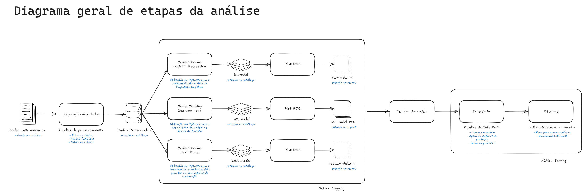

# Análise de Arremessos do Kobe Bryant - Projeto de Engenharia de Machine Learning

[](https://kedro.org)

Este projeto implementa uma análise de dados e modelo preditivo para os arremessos do Kobe Bryant durante sua carreira na NBA, utilizando o framework Kedro para organização e implementação.

## Diagrama do Pipeline



## Ferramentas Utilizadas

- **Kedro**: framework para organização do projeto e pipelines
- **MLflow**: rastreamento de experimentos e versionamento de modelos
- **PyCaret**: AutoML e treinamento de modelos
- **Scikit-learn**: implementação dos modelos
- **Streamlit**: dashboard de monitoramento

Rastreamento de experimentos: MLflow registra automaticamente parâmetros , métricas e artefatos.
Funções de treinamento: Podem ser implementadas no Kedro, usando PyCaret ou sklearn.
Monitoramento da saúde do modelo: é feito via logs do MLflow e posteriormento no dashboard streamlit.
Atualização de modelo: Com base na performance no streamlit e MLflow, retreinamos usando o mesmo pipeline.
Provisionamento (Deployment): servimos o modelo como uma API via MLFlow.

## Artefatos gerados

No decorrer do projeto, vários artefatos foram criados:

1. Dados de entrada
- /data/01_raw/dataset_kobe_dev.parquet e /data/01_raw/dataset_kobe_prod.parquet.

2. Dados pré-processados
- /data/02_intermediate/data_filtered.parquet
- Dataset com as linhas nulas removidas e colunas selecionadas, conforme solicitado no enunciado.
- Log no MLflow

3. Bases de treino e teste
- /data/03_primary/base_train.parquet e /data/03_primary/base_test.parquet.
- split estratificado em 80/20.
- Também registramos no MLflow o tamanho de cada base, % de split

4. Modelos treinados
- modelos salvos em /data/06_models/
- dois modelos:
  - Regressão Logística (com log loss)
  - Árvore de decisão (com log loss + F1 Score)

5. Previsões (inference) na base de produção
- Ao rodar o pipeline "PipelineAplicacao", o script lê /data/01_raw/dataset_kobe_prod.parquet, carrega o modelo escolhido do MLflow e gera previsões, salvando em /data/07_model_output/
- log loss e F1 Score para a nova base.
- Nome da run no MLflow: "PipelineAplicacao".

6. Dashboard de monitoramento
- App streamlit que mostra métricas atuais do modelo
- Versionado em src/kobe_shots_analysis/visualization/

## Como Executar

1. Instalar dependências:
```bash
pip install -r requirements.txt
```

2. Executar o pipeline:
```bash
kedro run
```

3. Iniciar o dashboard:
```bash
streamlit run src/kobe_shot_analysis/visualization/dashboard.py
```

## Respostas às Questões do Trabalho

### 1. Diagrama do Pipeline
O diagrama acima mostra o fluxo completo do projeto, desde a aquisição dos dados até o monitoramento em produção.

### 2. Ferramentas e seus Papéis

#### MLflow
- **Rastreamento de Experimentos**: Registro de parâmetros, métricas e artefatos
- **Funções de Treinamento**: Versionamento de modelos e pipelines
- **Monitoramento**: Tracking de métricas em produção
- **Atualização**: Gerenciamento de diferentes versões do modelo
- **Deployment**: Servindo modelos via MLflow

#### PyCaret
- AutoML para seleção de modelos
- Otimização de hiperparâmetros
- Comparação de modelos

#### Streamlit
- Dashboard interativo
- Visualização de métricas
- Monitoramento em tempo real

#### Scikit-learn
- Implementação dos modelos
- Métricas de avaliação
- Preprocessamento de dados

### 3. Artefatos do Projeto

1. **Dados Processados**
   - Dataset filtrado
   - Features engineering
   - Bases de treino e teste

2. **Modelos**
   - Modelo de regressão logística
   - Modelo de árvore de decisão
   - Modelo final selecionado

3. **Métricas e Avaliações**
   - Log loss
   - F1-score
   - Curvas ROC
   - Matriz de confusão

4. **Documentação**
   - README
   - Documentação de código
   - Relatórios de análise

### 4. Pipeline de Processamento

O pipeline implementa:
- Limpeza de dados faltantes
- Seleção de features específicas
- Divisão estratificada dos dados
- Registro de métricas no MLflow

### 5. Treinamento e Seleção de Modelo

- Implementação de dois modelos
- Comparação de performance
- Seleção baseada em métricas
- Registro no MLflow

### 6. Deployment e Monitoramento

- Servindo modelo via MLflow
- Pipeline de aplicação
- Dashboard de monitoramento
- Estratégias de retreinamento

## Monitoramento e Manutenção

### Saúde do Modelo
- Métricas de drift
- Performance em produção
- Alertas automáticos

### Estratégias de Retreinamento
- Reativo: Baseado em degradação de performance
- Preditivo: Baseado em padrões sazonais

## Rules and guidelines

In order to get the best out of the template:

* Don't remove any lines from the `.gitignore` file we provide
* Make sure your results can be reproduced by following a data engineering convention
* Don't commit data to your repository
* Don't commit any credentials or your local configuration to your repository. Keep all your credentials and local configuration in `conf/local/`

## How to install dependencies

Declare any dependencies in `requirements.txt` for `pip` installation.

To install them, run:

```
pip install -r requirements.txt
```

## How to run your Kedro pipeline

You can run your Kedro project with:

```
kedro run
```

## How to test your Kedro project

Have a look at the file `src/tests/test_run.py` for instructions on how to write your tests. You can run your tests as follows:

```
pytest
```

You can configure the coverage threshold in your project's `pyproject.toml` file under the `[tool.coverage.report]` section.


## Project dependencies

To see and update the dependency requirements for your project use `requirements.txt`. You can install the project requirements with `pip install -r requirements.txt`.

[Further information about project dependencies](https://docs.kedro.org/en/stable/kedro_project_setup/dependencies.html#project-specific-dependencies)

## How to work with Kedro and notebooks

> Note: Using `kedro jupyter` or `kedro ipython` to run your notebook provides these variables in scope: `context`, 'session', `catalog`, and `pipelines`.
>
> Jupyter, JupyterLab, and IPython are already included in the project requirements by default, so once you have run `pip install -r requirements.txt` you will not need to take any extra steps before you use them.

### Jupyter
To use Jupyter notebooks in your Kedro project, you need to install Jupyter:

```
pip install jupyter
```

After installing Jupyter, you can start a local notebook server:

```
kedro jupyter notebook
```

### JupyterLab
To use JupyterLab, you need to install it:

```
pip install jupyterlab
```

You can also start JupyterLab:

```
kedro jupyter lab
```

### IPython
And if you want to run an IPython session:

```
kedro ipython
```

### How to ignore notebook output cells in `git`
To automatically strip out all output cell contents before committing to `git`, you can use tools like [`nbstripout`](https://github.com/kynan/nbstripout). For example, you can add a hook in `.git/config` with `nbstripout --install`. This will run `nbstripout` before anything is committed to `git`.

> *Note:* Your output cells will be retained locally.

## Package your Kedro project

[Further information about building project documentation and packaging your project](https://docs.kedro.org/en/stable/tutorial/package_a_project.html)
